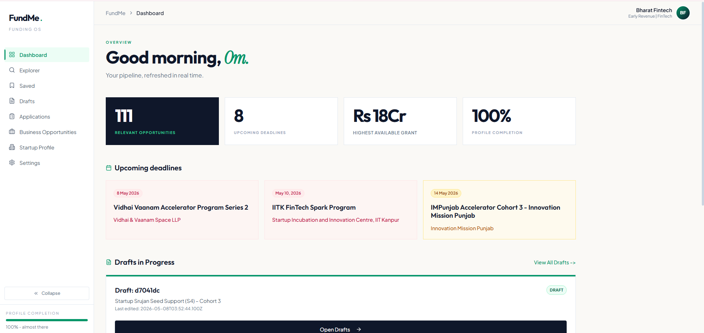

# FundMe Product Features

FundMe is an AI-powered funding operating system for startup founders. The product helps a founder build a reusable startup profile, discover relevant funding and business opportunities, generate application drafts, open official application portals with context ready for auto-fill, and track every application through a structured pipeline.

The application is built as a React frontend with a Node/Express backend and JSON-backed local storage. It includes a Chrome extension workflow for external application portals, AI utilities for profile generation and draft writing, and scrapers for startup grants and government procurement opportunities.

## Product Summary

FundMe brings the startup funding workflow into one workspace:

- Discover grants, accelerators, incubators, seed funding programs, contests, fellowships, tenders, reverse auctions, and other business opportunities.
- Rank opportunities against the founder profile using AI-powered match scoring.
- Save opportunities for later review.
- Start a structured application draft from any opportunity.
- Generate application answers from the startup profile and opportunity context.
- Use the Chrome extension to capture and fill external application forms.
- Track applications with stages, notes, deadlines, follow-ups, priority, and owner/contact details.
- Maintain a complete startup profile that improves matching and draft quality over time.

## Target Users

FundMe is mainly designed for startup founders and founding teams who apply to multiple funding programs and need a repeatable process. It also supports teams that are exploring non-grant business opportunities such as government tenders, pilots, and corporate co-builds.

Primary users:

- Early-stage founders looking for grants and startup programs.
- Growth-stage founders tracking multiple applications at once.
- Startup operators who manage deadlines, drafts, and follow-up tasks.
- Teams applying to external portals that require repeated company information.

## Core Workflow

1. A founder creates an account.
2. The founder builds a startup profile manually or with AI assistance.
3. FundMe lists matching opportunities from the local opportunity database.
4. The founder filters, searches, saves, and opens opportunity details.
5. The founder starts an AI-assisted application draft.
6. The draft editor stores structured answers by form field.
7. The Apply to Portal flow opens the official application link.
8. The Chrome extension can capture visible form fields, ask FundMe for answers, and fill the external portal.
9. After submitting manually, the founder marks the item as applied.
10. The Applications Tracker becomes the source of truth for status, follow-ups, notes, and outcomes.

## Screenshot Gallery

| Product Area | Suggested Screenshot Path | What To Capture |
| --- | --- | --- |
| Landing page | `docs/screenshots/landingpage.png` | Public product positioning, CTA, and workflow overview. |
| Signup | `docs/screenshots/signup.png` | Founder signup form and password validation rules. |
| AI onboarding | `docs/screenshots/onboarding-profile.png` | URL, summary, and PDF inputs for AI profile generation. |
| Dashboard | `docs/screenshots/dashboard.png` | KPI cards, upcoming deadlines, drafts, and high relevance matches. |
| Explorer | `docs/screenshots/explorer.png` | Search, filters, grid/list controls, and opportunity cards. |
| Opportunity details | `docs/screenshots/opportunity-details.png` | Match score, program snapshot, eligibility, benefits, and apply actions. |
| Saved opportunities | `docs/screenshots/saved.png` | Saved funding programs collected by the founder. |
| Drafts | `docs/screenshots/drafts.png` | Draft list, completion progress, portal apply flow, and mark-applied action. |
| Draft editor | `docs/screenshots/draft-editor.png` | Structured form sections, AI Generate, Save, Review, and Apply to Portal. |
| Applications tracker | `docs/screenshots/applications.png` | Kanban pipeline, stage stats, insights, and side panel editor. |
| Business opportunities | `docs/screenshots/business-opportunities.png` | Tender, reverse auction, pilot, and contest discovery. |
| Startup profile | `docs/screenshots/startup-profile.png` | Company, story, traction, and presence fields. |
| Settings | `docs/screenshots/settings.png` | Account, notifications, privacy, and billing settings. |
| Chrome extension | `docs/screenshots/extension.png` | Popup controls for diagnose, capture, generate, and fill. |

Example image syntax after adding a file:

```md

```

## Product Modules

### 1. Public Landing Page

Route: `/`

The landing page introduces FundMe as a funding OS for Indian founders. It explains the product through three jobs:

- Discovery that thinks like an analyst.
- Drafting faster with founder context.
- Tracking the funding pipeline until it closes.

Key elements:

- Login and Get Started CTAs.
- Product workflow cards.
- Metrics and social proof-style program names.
- Explanation of the profile-to-match-to-draft-to-track process.

### 2. Authentication

Routes:

- `/signup`
- `/login`
- `/forgot-password`

The authentication flow is founder-focused. Signup stores a local user profile and immediately moves the founder into onboarding.

Signup features:

- Founder role assignment.
- Full name, email, and password fields.
- Password rules requiring at least 8 characters, one uppercase letter, and one number.
- Password visibility toggle.
- Inline validation and toast feedback.

Login features:

- Email and password sign-in.
- Local auth persistence through `localStorage`.
- Redirect back to the intended protected route after successful login.
- Error handling through API response messages.

Protected routes depend on the presence of a stored user ID. If the backend returns a `401`, the frontend clears local auth state.

### 3. AI Onboarding

Routes:

- `/onboarding/profile`
- `/onboarding/review`

The onboarding flow builds the startup profile quickly using AI.

The founder can provide:

- A website URL.
- A short startup summary.
- A PDF pitch deck or supporting document.

The backend sends this material to the AI profile generation endpoint. The generated profile is stored temporarily in session storage and shown on the review page before saving.

Generated profile fields include:

- Startup name.
- Sector.
- Stage.
- Startup overview.
- Problem statement.
- Solution summary.
- Target customers.
- Business model.

The review step allows the founder to inspect and edit the AI-generated fields before saving them as the canonical founder profile.

### 4. Application Shell And Navigation

Protected routes are wrapped in the shared app layout.

Navigation items:

- Dashboard.
- Explorer.
- Saved.
- Drafts.
- Applications.
- Business Opportunities.
- Startup Profile.
- Settings.

Shell features:

- Collapsible sidebar.
- Active route indicator.
- Sticky top header.
- User/startup chip with dropdown menu.
- Profile completion progress.
- Sign out action.

The shell reloads profile information as the user moves through the app, so navigation, avatar initials, and completion percentage stay current.

### 5. Dashboard

Route: `/dashboard`

The dashboard is the founder's operating overview.

Main sections:

- KPI cards for relevant opportunities, upcoming deadlines, highest available grant, and profile completion.
- Upcoming deadlines for high-fit funding opportunities in the next 30 days.
- Drafts in progress with quick access back to the drafts workspace.
- High relevance matches ranked by AI score.

The dashboard combines:

- Opportunity data.
- Draft data.
- Founder profile completeness.
- Cached or generated match scores.

It helps the founder decide what to apply to next without manually scanning every program.

### 6. Opportunities Explorer

Route: `/explorer`

The Explorer is the main discovery surface for grants and startup programs.

Filters:

- Startup stage: Idea, MVP, Early Revenue, Growth, PMF.
- Sector: AI / ML, AgriTech, DeepTech, Fintech, HealthTech, Manufacturing, Social Impact.
- Funding type: Grant, Accelerator, Incubation, Seed Funding, Contest, Fellowship.

Explorer features:

- Search by opportunity name or organisation.
- Collapsible filter panel.
- Active filter count.
- Clear filters action.
- Grid and list view controls.
- AI match scores when a profile is available.
- Draft state awareness for each opportunity.

Each opportunity card supports:

- Opening the details page.
- Saving or unsaving.
- Starting a draft.
- Applying to the official portal.
- Checking eligibility through AI.

### 7. Opportunity Details

Route: `/explorer/:id`

The opportunity detail page turns one funding program into an application workspace.

Main content:

- Description.
- Eligibility.
- Benefits and funding.
- Submission requirements.

Sidebar content:

- AI match score.
- Deadline.
- Funding amount.
- Location.
- Opportunity type.
- Application journey.

Primary actions:

- Save or unsave.
- Start draft.
- Review existing draft.
- Apply to Portal.

The Apply to Portal action prepares extension context so the browser extension can connect the official portal to the FundMe draft.

### 8. Saved Opportunities

Route: `/saved`

The Saved page collects opportunities bookmarked by the founder.

Features:

- Loads saved opportunities for the current user.
- Reuses the same opportunity card component as Explorer.
- Allows unsaving directly from the saved list.
- Keeps the saved state synchronized when a card changes.

This page is useful for founders who shortlist programs before deciding which ones deserve a draft.

### 9. AI Drafts

Route: `/drafts`

The Drafts page manages all application drafts.

Draft card features:

- Opportunity title.
- Draft ID.
- Last edited timestamp.
- Draft status.
- AI completion percentage.
- Whether the opportunity is already tracked as an application.

Draft actions:

- Apply to Portal.
- Edit Draft.
- Review Draft.
- Mark Applied.
- Track in Applications.

The page explains the workflow in three steps:

- Draft started.
- Fill portal.
- Review and submit.

When the extension is not installed, FundMe opens an installation modal and lets the founder continue without the extension if needed.

### 10. Draft Editor

Route: `/drafts/:id`

The draft editor is schema-driven. It displays application fields based on the draft's stored `form_schema`.

Editor features:

- Groups fields by application section.
- Supports text, textarea, email, URL, number, date, and telephone inputs.
- Displays required markers.
- Shows helper text and max word counts when available.
- Saves answers back to the backend.
- Generates answers using AI from the founder profile, form schema, and opportunity context.
- Provides a read-only review mode with `?review=true`.

Primary actions:

- Generate.
- Save.
- Review Draft.
- Edit Draft.
- Apply to Portal.

This is the core writing workspace. The product is not tied to a fixed form template; it can work with AI-inferred schemas or schemas captured by the extension from a live external portal.

### 11. Applications Tracker

Route: `/applications`

The Applications Tracker is a Kanban-style pipeline for submitted and in-progress opportunities.

Application stages:

- Applied.
- Under Review.
- Shortlisted.
- Interview / Pitch Round.
- Accepted.
- Rejected.
- Waitlisted.
- Withdrawn.

Top-level metrics:

- Total applied.
- Active pipeline.
- Follow-ups due.
- Under review.
- Accepted.
- Rejected.

Kanban features:

- One column per stage.
- Application cards with provider, amount, applied date, deadline, follow-up, priority, next step, and match score.
- Quick status change from the card.
- Empty state per column.

Application detail panel:

- Provider, funding, applied date, and deadline.
- Current status.
- Priority.
- Follow-up date.
- Phase control buttons.
- Editable phase ledger with date and notes for every stage.
- Next step.
- Owner/contact.
- Notes and feedback.
- Phase history preview.
- Open portal action.

Pipeline Signals:

- Acceptance rate insights.
- Rejection learning prompts.
- Under-review reminders.
- Follow-up warnings.

This module turns funding applications into an operating workflow instead of a static list.

### 12. Business Opportunities

Route: `/business`

Business Opportunities separates revenue-oriented opportunities from classic startup funding.

Supported types:

- Tender.
- Reverse Auction.
- Contest.
- Fellowship.
- Other.

Filters:

- Opportunity type.
- Sector.
- Benefits.

Business opportunity examples:

- Government procurement.
- Pilot contracts.
- Paid trials.
- Mentorship-linked business programs.
- Access to infrastructure.

This module is designed for startups that want not only funding but also market access and commercial traction.

### 13. Startup Profile

Route: `/profile`

The Startup Profile is the reusable context layer for all AI and matching features.

Profile sections:

- Company.
- Problem & Solution.
- Traction & Metrics.
- Presence & Links.

Stored fields include:

- Startup name.
- Overview.
- Stage.
- Sector.
- Founded year.
- Incorporation details.
- DPIIT details.
- Headquarters.
- Problem statement.
- Solution summary.
- Target customers.
- Business model.
- Team size.
- Revenue.
- Traction summary.
- Website.

The app uses this profile to:

- Calculate profile completion.
- Generate better opportunity matches.
- Draft application answers.
- Personalize the app shell and dashboard.

### 14. Settings

Route: `/settings`

Settings covers account, notifications, privacy, and billing.

Account tab:

- Full name.
- Email.
- Phone.
- Designation.

Notifications tab:

- Deadline reminders.
- New high-relevance matches.
- Weekly digest.
- Product updates.

Privacy & Security tab:

- Password fields.
- Two-factor authentication toggle placeholder.
- Delete account action.

Billing tab:

- Current plan display.
- Upgrade CTA.
- Billing email.
- GSTIN.

The user record is updated through the backend and refreshed into local auth state after saving.

### 15. Chrome Extension Smart Apply Flow

Location: `backend/chrome_extension/`

The Chrome extension supports applying on external portals.

Expected flow:

1. The founder clicks Apply to Portal in FundMe.
2. FundMe stages context for the opportunity and external URL.
3. The official application portal opens in a new tab.
4. The extension detects or receives the staged session.
5. The extension captures visible form fields from the external page.
6. FundMe generates draft answers from the founder profile and opportunity context.
7. The extension fills the external form fields.
8. The founder reviews every answer and manually submits the application.

Extension files:

- `manifest.json`.
- `background.js`.
- `content.js`.
- `popup.js`.
- `popup.html`.
- `popup.css`.

Important limits:

- The extension does not silently upload files.
- The extension does not submit applications automatically.
- The founder remains responsible for reviewing and submitting the final form.
- The current extension session model should be hardened before public launch.

## AI Features

FundMe uses AI in several focused places.

### AI Profile Generation

Endpoint: `POST /api/ai/generate-profile`

Inputs:

- PDF file.
- Startup overview text.
- Website URL.

Outputs:

- Structured founder profile fields.

Purpose:

- Reduce onboarding friction.
- Extract reusable startup context from existing materials.
- Improve matching and drafting quality.

### AI Match Scoring

Endpoint: `POST /api/ai/match-opportunities`

Inputs:

- Founder profile.
- Lightweight opportunity objects.

Outputs:

- Opportunity IDs.
- Scores from 0 to 100.
- Short reasons when available.

The backend caches match scores in `match_scores` so repeated loads do not always require a new AI call.

### AI Opportunity Summary

Endpoint: `POST /api/ai/summarize-opportunity`

Purpose:

- Summarize long opportunity descriptions into short bullet points.

### AI Eligibility Check

Endpoint: `POST /api/ai/eligibility`

Purpose:

- Compare founder profile details against opportunity eligibility rules.
- Return a practical eligibility interpretation.

### AI Application Schema Generation

Endpoint: `POST /api/ai/generate-application-schema`

Purpose:

- Create structured application form schemas from opportunity context.
- Support new opportunity types without hardcoded templates.

### AI Draft Generation

Endpoint: `POST /api/ai/generate-draft`

Purpose:

- Generate draft answers for structured form fields.
- Use founder profile, form schema, and opportunity data.
- Preserve field-level structure so answers can be reviewed and filled into external portals.

### AI Field Mapping

Endpoint: `POST /api/ai/map-fields`

Purpose:

- Map captured external portal fields to FundMe draft fields.
- Help the extension fill the right answer into the right portal input.

### AI Draft Progress

Endpoint: `POST /api/ai/draft-progress`

Purpose:

- Estimate completion and identify missing answers in an application draft.

## Opportunity Data Pipeline

The backend includes scraping and normalization logic for opportunity discovery.

Main scraper file:

- `backend/services/scraper.js`

Sources supported by the scraper:

- StartupGrantsIndia listing pages.
- StartupGrantsIndia detail pages.
- GeM bid opportunities through government e-marketplace bid data.

Scraper features:

- Multi-page listing scrape.
- Detail page extraction.
- External apply link extraction.
- Amount extraction.
- Deadline normalization.
- Duplicate filtering.
- Retry handling.
- Rate-limit handling.
- Smart pagination stop after repeated empty pages.
- GeM tender and reverse auction mapping.

Opportunity fields include:

- `opportunity_id`
- `title`
- `provider`
- `description`
- `eligibility`
- `benefits`
- `timeline`
- `type`
- `amount`
- `deadline`
- `location`
- `sector`
- `stage`
- `link`
- `external_apply_url`
- `slug`
- `raw_scraped_text`
- `credibility_source`
- `match_score`
- `source`

## Backend API Surface

The Express backend exposes endpoints for authentication, profile management, opportunities, saved items, applications, drafts, extension sessions, documents, and AI.

Authentication:

- `POST /api/signup`
- `POST /api/login`
- `GET /api/users/check-email`
- `GET /api/user`
- `PUT /api/user`

Uploads and documents:

- `POST /api/upload`
- `GET /api/documents`
- `DELETE /api/documents/:document_id`

Founder profile:

- `GET /api/founder/profile`
- `POST /api/founder/profile`
- `PUT /api/founder/profile`

Opportunities:

- `GET /api/opportunities`
- `GET /api/opportunities/:id`
- `GET /api/opportunities/:id/details`
- `GET /api/business-opportunities`
- `GET /api/trigger-scraper`
- `GET /api/scraper-status`

Saved opportunities:

- `GET /api/saved`
- `POST /api/saved`
- `DELETE /api/saved`
- `DELETE /api/saved/:id`

Applications:

- `GET /api/applications`
- `GET /api/applications/:id`
- `POST /api/applications`
- `PUT /api/applications/:id`
- `GET /api/applications/deadline-reminders`
- `GET /api/applications/analytics`

Drafts:

- `GET /api/drafts`
- `GET /api/drafts/by-opportunity`
- `POST /api/drafts/bootstrap`
- `GET /api/drafts/:id`
- `PUT /api/drafts/:id`

Extension:

- `POST /api/extension/session`
- `GET /api/extension/session`

AI:

- `POST /api/ai/generate-profile`
- `POST /api/ai/generate-application-schema`
- `POST /api/ai/feedback-insights`
- `POST /api/ai/match-opportunities`
- `POST /api/ai/summarize-opportunity`
- `POST /api/ai/eligibility`
- `POST /api/ai/generate-draft`
- `POST /api/ai/map-fields`
- `POST /api/ai/draft-progress`
- `POST /api/ai/format-details`

## Data Model

FundMe currently uses local JSON storage at:

- `backend/data/db.json`

Current local dataset snapshot:

| Collection | Records |
| --- | ---: |
| users | 5 |
| founder_profiles | 4 |
| opportunities | 111 |
| saved_opportunities | 13 |
| applications | 5 |
| drafts | 6 |
| extension_sessions | 14 |
| documents | 0 |
| match_scores | 127 |

Primary collections:

- `users`: founder accounts and account settings.
- `founder_profiles`: startup profile data used for matching and AI drafting.
- `opportunities`: scraped and normalized funding and business programs.
- `saved_opportunities`: user-specific saved items.
- `applications`: tracked applications and phase history.
- `drafts`: schema-driven application drafts.
- `extension_sessions`: staged portal context for the Chrome extension.
- `documents`: uploaded document metadata.
- `match_scores`: cached AI match scores per user and opportunity.

## Technical Stack

Frontend:

- React 19.
- React Router.
- Tailwind CSS.
- Radix UI components.
- Lucide React icons.
- Framer Motion.
- Recharts.
- Sonner toasts.
- Axios API client.

Backend:

- Node.js.
- Express.
- Multer for file upload handling.
- bcrypt for password hashing.
- Cheerio and Axios for scraping.
- Puppeteer dependency for browser-based scraping workflows.
- node-cron for scheduled work.
- pdf-parse for PDF profile extraction.

AI providers supported by backend utilities:

- Groq.
- OpenRouter.
- Google AI Studio.

Storage:

- Local JSON database in `backend/data/db.json`.

## Repository Structure

Important paths:

- `src/App.js`: route definitions.
- `src/pages/`: route-level React screens.
- `src/components/OpportunityCard.jsx`: reusable opportunity card actions.
- `src/components/layout/AppLayout.jsx`: protected app shell.
- `src/lib/api.js`: frontend API client.
- `src/lib/auth.js`: local auth helpers.
- `src/lib/applyFlow.js`: extension staging helpers.
- `backend/server.js`: main Express API and React build server.
- `backend/services/scraper.js`: opportunity scraping logic.
- `backend/utils/ai.js`: AI provider routing.
- `backend/utils/formDrafts.js`: schema-driven draft helpers.
- `backend/chrome_extension/`: Chrome extension source.
- `backend/evals/`: evaluation harness and datasets.
- `backend/scripts/`: data cleanup and repair scripts.

## Local Development

Install dependencies:

```bash
npm run install-all
```

Build the frontend:

```bash
npm run build
```

Run the backend:

```bash
npm run server
```

Run the backend in development mode:

```bash
npm run dev
```

The backend serves the React build when `build/index.html` exists.

Default local URL:

```text
http://localhost:3000
```

## Evaluation And Quality Checks

The repository includes an evaluation harness under `backend/evals/`.

Evaluation areas include:

- Profile generation.
- Opportunity summarization.
- Eligibility checks.
- Match scoring.
- Scraper cleaning.
- Detail extraction.

The backend package exposes:

```bash
npm run eval
```

The existing evaluation report shows previous AI calls failed in that run because provider fetches failed. The evaluation structure is still useful for regression testing once API keys and network access are available.

## Production Notes

Already implemented or partially implemented:

- bcrypt password hashing.
- Local auth state handling.
- Structured logging utilities.
- File upload support.
- Application analytics and deadline reminder endpoints.
- Match score caching.
- Scraper retry and validation logic.
- Schema-driven drafts.
- Chrome extension staged sessions.

Before a real public launch, the project should move beyond local JSON storage.

Recommended production upgrades:

- Replace `db.json` with Postgres or another transactional database.
- Add session tokens or JWT auth instead of local user ID trust.
- Add authenticated extension handshakes.
- Move secrets fully into environment variables or a secrets manager.
- Add automated tests for key user flows.
- Add CI checks for lint, build, and backend route smoke tests.
- Harden document upload validation and storage.
- Add role-based access if investor/admin workflows become separate modules.

## Known Limitations

- Screenshots are not currently included in this file.
- The Chrome extension does not upload files or submit forms automatically.
- AI features require valid provider keys and network access.
- Local JSON storage is not safe for multi-user production use.
- Some settings controls are UI-ready but not fully security-backed yet, such as two-factor authentication.
- The extension session model is useful for local/demo workflows but should be strengthened before production.

## End-To-End Value

FundMe reduces the repeated admin work involved in startup funding. Instead of tracking opportunities in scattered spreadsheets and rewriting the same company story across portals, the founder keeps one profile, one opportunity database, one draft workspace, one extension-assisted apply flow, and one application tracker.

The product is strongest when used as a full workflow:

- Profile once.
- Discover continuously.
- Draft with context.
- Apply through the official portal.
- Track every outcome.
- Use results and feedback to improve the next application.

